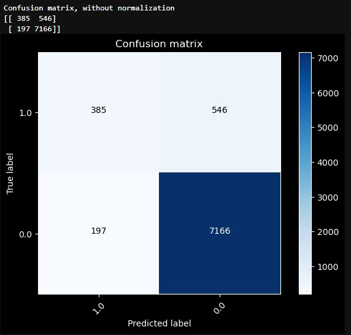

# MiniProject2 - Project Summary

## Data Description
The data consists of 41188 observations of 20 features and the subscribe response: 'y'.

### Client demographics:
1. **age** (numeric)
2. **job**: type of job (categorical)
3. **marital**: marital status (categorical)
4. **education** (categorical)
5. **default**: has credit in default? (categorical)
6. **housing**: has housing loan? (categorical)
7. **loan**: has personal loan? (categorical)
### Attributes regarding the latest contact in the ongoing campaign:
8. **contact**: contact communication type (categorical)
9. **month**: last contact month of year (categorical)
10. **day_of_week**: last contact day of the week (categorical)
11. **duration**: last contact duration, in seconds (numeric)
### Other attributes:
12. **campaign**: number of contacts performed during this campaign and for this client (numeric, includes last contact)
13. **pdays**: number of days that passed by after the client was last contacted from a previous campaign (numeric; 999 means client was not previously contacted)
14. **previous**: number of contacts performed before this campaign and for this client (numeric)
15. **poutcome**: outcome of the previous marketing campaign (categorical)
### Social and economic context attributes:
16. **emp.var.rate**: employment variation rate - quarterly indicator (numeric)
17. **cons.price.idx**: consumer price index - monthly indicator (numeric) 
18. **cons.conf.idx**: consumer confidence index - monthly indicator (numeric) 
19. **euribor3m**: euribor 3 month rate - daily indicator (numeric)
20. **nr.employed**: number of employees - quarterly indicator (numeric)

## Data Loading and Cleaning
The majority of the data processing was handled with PySpark, a Python interface of Apache Spark. Please reference the latest documentation with questions regarding the syntax or API methods. 

[PySpark Documentation](https://spark.apache.org/docs/latest/api/python/)

### Load and inspect
The PySpark API loaded the data easily after discovering the delimiter was altered from the standard comma to a semi-colon. Additional parameters were included to indicate the presence of a header and to attempt to infer the data's schema. 

|age|      job|marital|  education|default|housing|loan|  contact|month|day_of_week|duration|campaign|pdays|previous|   poutcome|emp.var.rate|cons.price.idx|cons.conf.idx|euribor3m|nr.employed|  y|
|---|---------|-------|-----------|-------|-------|----|---------|-----|-----------|--------|--------|-----|--------|-----------|------------|--------------|-------------|---------|-----------|---|
| 56|housemaid|married|   basic.4y|     no|     no|  no|telephone|  may|        mon|     261|       1|  999|       0|nonexistent|         1.1|        93.994|        -36.4|    4.857|     5191.0| no|
| 57| services|married|high.school|unknown|     no|  no|telephone|  may|        mon|     149|       1|  999|       0|nonexistent|         1.1|        93.994|        -36.4|    4.857|     5191.0| no|
| 37| services|married|high.school|     no|    yes|  no|telephone|  may|        mon|     226|       1|  999|       0|nonexistent|         1.1|        93.994|        -36.4|    4.857|     5191.0| no|
| 40|   admin.|married|   basic.6y|     no|     no|  no|telephone|  may|        mon|     151|       1|  999|       0|nonexistent|         1.1|        93.994|        -36.4|    4.857|     5191.0| no|

Column names containing period separation marks were altered to avoid issues. These columns included emp.var.rate, cons.price.idx, cons.conf.idx, and nr.employed.

A quick spot check of the response, 'y', count revealed the class of interest was the minority class. 

|  y|count|
|---|-----|
| no|36548|
|yes| 4640|

*Initial Null Counts*

|age|job|marital|education|default|housing|loan|contact|month|day_of_week|duration|campaign|pdays|previous|poutcome|emp_var_rate|cons_price_idx|cons_conf_idx|euribor3m|nr_employed|  y|
|---|---|-------|---------|-------|-------|----|-------|-----|-----------|--------|--------|-----|--------|--------|------------|--------------|-------------|---------|-----------|---|
|  0|  0|      0|        0|      0|      0|   0|      0|    0|          0|       0|       0|    0|       0|       0|           0|             0|            0|        0|          0|  0|

Next, nulls were assessed, however, the description given for 'pdays' indicates substitutions were made for null values. Since no other numeric columns contain this caveat, all other numeric columns are assumed to not have null replacements this was noted to be verified later when assessing the numeric features' distributions. The categorical features classes were assessed for null substitions. 
### job
|          job|count|
|-------------|-----|
|   management| 2924|
|      retired| 1720|
|    **unknown**|  330|
|self-employed| 1421|
|      student|  875|
|  blue-collar| 9254|
| entrepreneur| 1456|
|       admin.|10422|
|   technician| 6743|
|     services| 3969|
|    housemaid| 1060|
|   unemployed| 1014|

### marital
| marital|count|
|--------|-----|
| **unknown**|   80|
|divorced| 4612|
| married|24928|
|  single|11568|

Job, marital, education, default, housing, and loan all contained an "unknown" class. Since "unknown" is taken to mean there is no data were on concerning the feature for the observation, unknown instances were replaced with NA values. Contact, month, day_of_week, and poutcome did not contain this "unknown" level so no changes were made to those features. 

*Post-Transform Null Counts*
|age|job|marital|education|default|housing|loan|contact|month|day_of_week|duration|campaign|pdays|previous|poutcome|emp_var_rate|cons_price_idx|cons_conf_idx|euribor3m|nr_employed|  y|
|---|---|-------|---------|-------|-------|----|-------|-----|-----------|--------|--------|-----|--------|--------|------------|--------------|-------------|---------|-----------|---|
|  0|  0|     80|     1731|   8597|    990| 990|      0|    0|          0|       0|       0|39673|       0|       0|           0|             0|            0|        0|          0|  0|

## EDA/descriptive statistics

### Feature Correlation

### Bivariate Analysis

## Processing/Cleaning
Since we wanted to preserve any information presented from the null instances an indicator column was created for each feature containing nulls and the the nulls were filled with imputed values.

A transformation pipeline was created to pipe the data into a numeric feature set to be used in training and testing a logistic regression model. The pipeline consisted of the following steps:
- StringIndexer
    - one for each categorial feature and the response 
- OneHotEncoder - transforming each of the indexed string outputs to a one-hot encoded set
- VectorAssembler - merging all features to a single vectorized feature
- StandardScaler - rescaling the vectorized feature set

## Statistical Modeling
After running the data through the pipeline described above we're have our entire dataset along with the rescaled vectorized feature set column. The data is randomly split into training and test sets and a logistic model created. 
